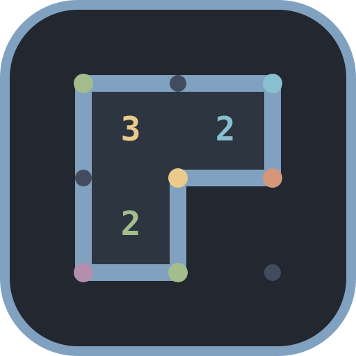
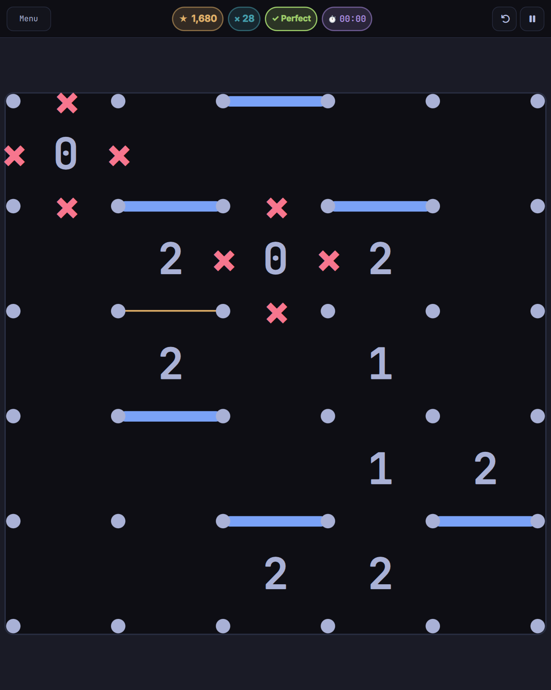

#  Slitherlink for Omarchy

**Website:** [parnoldx.github.io/omaslitherlink](https://parnoldx.github.io/omaslitherlink/)

A native Slitherlink arcade puzzle for **Omarchy**.



---

## Highlights

- **Looks like Omarchy** — picks up your desktop theme and updates live when it changes.
- **Arcade scoring** — four difficulties (Easy → Master), time-decay multiplier, clue bonuses, three-mistake series.
- **Fluid controls** — drag-to-draw lines (left mouse), drag crosses (right mouse), auto-cross 0s and satisfied clues with a single click, or play keyboard-first with an edge cursor.
- **Pick up later** — unfinished games resume; best scores per difficulty.

---

## Install

```bash
./install.sh
```

That builds and installs:

- `~/.local/bin/omarchy-slitherlink`
- Desktop entry + icon for the Omarchy app launcher

Then run `omarchy-slitherlink` or search for **Slitherlink**.

---

## Build & test (developers)

```bash
cmake -S . -B build -DCMAKE_BUILD_TYPE=Release
cmake --build build
./build/omarchy-slitherlink

cmake --build build --target test_game
./build/test_game
# or: ctest --test-dir build --output-on-failure
```
